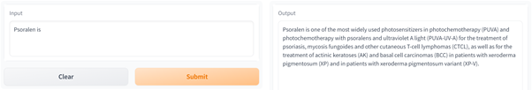

# BioGPT with HF Transformers
A notebook to evaluate [BioGPT](https://academic.oup.com/bib/article/23/6/bbac409/6713511?guestAccessKey=a66d9b5d-4f83-4017-bb52-405815c907b9), Microsoft's domain-specific generative Transformer language model pre-trained on large-scale biomedical literature, through the Hugging Face's [Transformers](https://huggingface.co/docs/transformers/index) library.    
The code in this notebooks executes on CPU.  
  
 