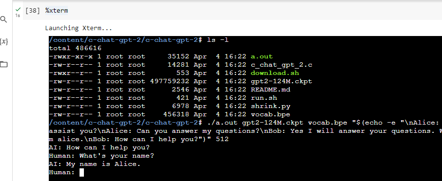

A notebook to compile Nicholas Carlini's C-ChatGPT (a ChatGPT clone, in 3000 bytes of C, backed by GPT-2) and start a chat with the model within a Colab VM.  
More explanations about the C code [here](https://nicholas.carlini.com/writing/2023/chat-gpt-2-in-c.html).  
No hardware acceleration needed to execute the code in this notebook: a regualr free Colab GPU VM is enough.  
  
 