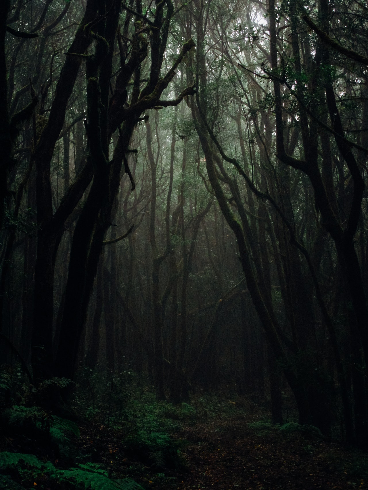
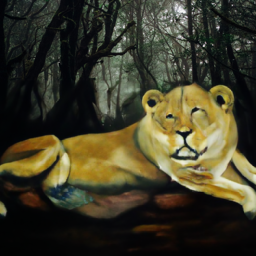

# Image Inpainting Using GLIDE
A more user friendly notebook derived from the original in the **glide-text2im** GitHub [repo](https://github.com/openai/glide-text2im), that shows how to use filtered **GLIDE** to fill in a masked region of an image, conditioned on a text prompt. Here's the [link](https://arxiv.org/abs/2112.10741) to the related paper.  
  
Source image:    
  

An oil painting of a lion:  
  
