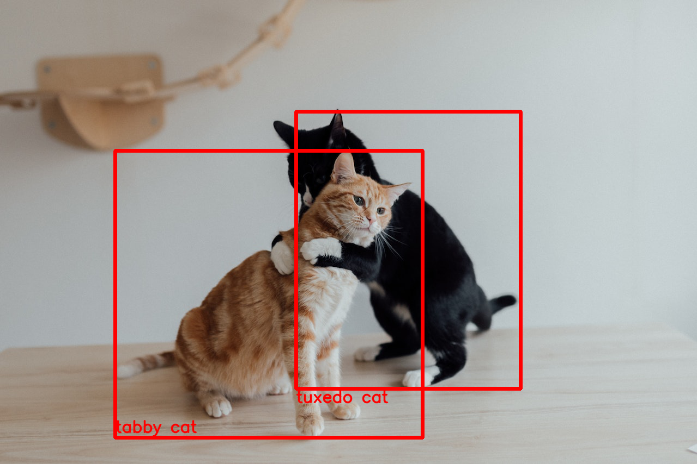

# Object detection with Vision Transformer for Open-World Localization (OWL-ViT)
The **[OWL-ViT](https://arxiv.org/abs/2205.06230)** model is an **open-vocabulary object detection model** that uses the standard Vision Transformer to perform detection.  
  
Given an image and a free-text query, it finds objects matching that query in the image. It can also do one-shot object detection, i.e. detect objects based on a single example image. This notebook is to evaluate both tasks through the pre-trained model available in the Hugging Face's *transformers* library.   
As a result of my evaluation of this model, it looks like it is robust with reference to the open-vocabulary object detection task, but not yet robust enough to perform accurate one-shot object detection.   
Execution of the code in this notebook is fast on CPU: no need for hardware acceleration.  
### Example
Search texts: "tuxedo cat", "tabby cat"  
