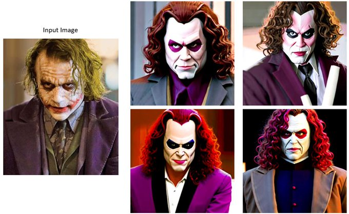

# Stable Diffusion Image Variations
A user-friendly notebook for image-to-image generation using a fine-tuned version of Stable Diffusion conditioned on CLIP image embeddings. It uses the code from the [lambad-diffusers](https://github.com/LambdaLabsML/lambda-diffusers) repo. Execution details within the notebook text cells.  
GPU acceleration is needed to execute the code in this notebook.  
  
