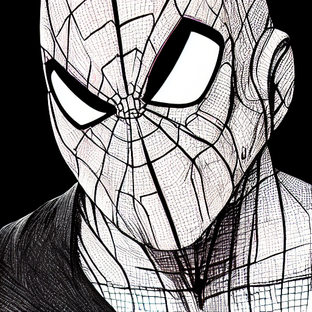
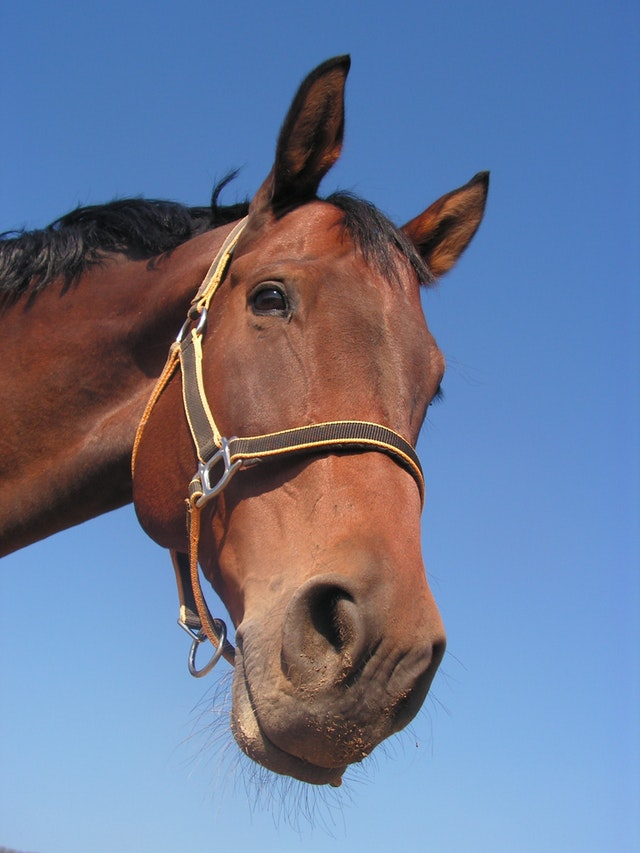
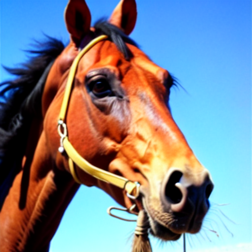
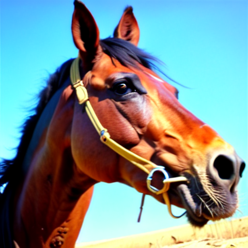
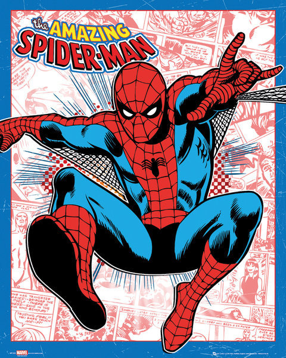
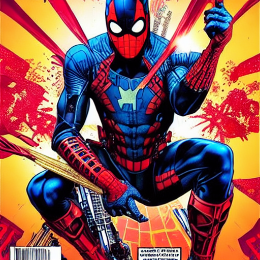
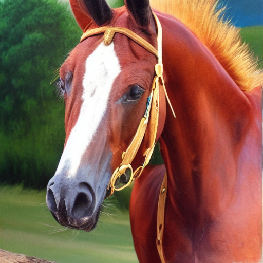
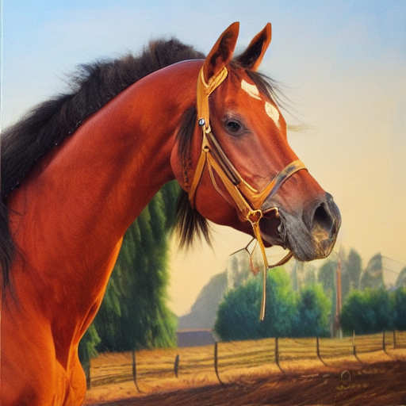

# Versatile Diffusion
The [Versatile Diffusion](https://arxiv.org/abs/2211.08332) paper expands the existing single-flow diffusion pipeline into a multi-flow network that handles diverse generation tasks in one unified model. Here's a notebook to evaluate some of the VD tasks: text-to-image, image-variation and dual-guided generation. These tasks are executed here through the Hugging Face's [Diffusers](https://github.com/huggingface/diffusers) library.  
  
  
## Examples
### Text 2 image
Prompt: A portrait of Spider-man, high definition, comics style. Seed = 0  
  
### Image Variation
Source:  
  
Variations:  
   
### Dual-guided generation
Prompt: Spider man. cyberpunk assassin. blade runner 2 0 4 9 concept painting. epic painting by craig mullins and alphonso mucha. artstationhq. painting with vivid color. ( rb 6 s, cyberpunk 2 0 7 7, matrix )  
Source: 
  
Generated: 
   
  
Source:  
  
Prompt: A portrait of a horse, oil painting.  
Generated:  
 